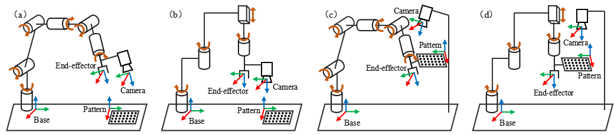
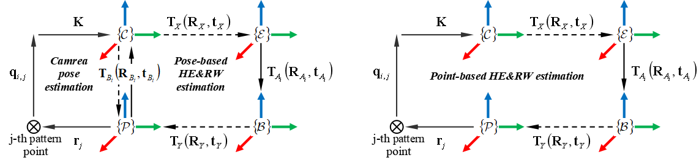

## Nonsingular Hand-Eye and Robot-World Calibration for SCARA-Type Robots

## Reference paper
Nonsingular Hand-Eye and Robot-World Calibration for SCARA-Type Robots: A Comparative Study (2024), submitted to IEEE TII.

## Overview

<p align="center">
   
</p>

**_Figure_**: Visual representations of hand-eye and robot-world calibration for (a) an articulated robot in eye-in-hand configuration, (b) a SCARA robot in eye-in-hand configuration, (c) an articulated robot in eye-to-base configuration, and (d) an articulated robot in eye-to-base configuration.

Four degree-of-freedom SCARA robots are increasingly used in industry due to their unique advantages in speed and accuracy. When integrated into visual-guided systems with cameras, SCARA robots require hand-eye and robot-world (HE&RW) calibration to establish the system’s geometric relationships. The common calibration methods are pose-based or point-based, which have been widely validated on full degree-of-freedom articulated robots. However, these methods may appear singular and unusable due to SCARA’s restricted movement. Inspired by this, we conduct a thorough study on HE&RW calibration for SCARA robots. In the above reference paper, we first analyze the reasons for the SCARA singularity of conventional methods from the perspective of nonlinear least squares. Then, we redefine parameters with clear geometric interpretation and propose two
nonsingular HE&RW calibration methods. This repository contains the implementations of the four methods discussed in our article：1) the conventional pose-based method, 2) the proposed posebased method, 3) the conventional point-based method, and 4) the proposed point-based method. Besides, we provide two demos for testing.


<p align="center">
   
</p>

**_Figure_**: In pose-based calibration (left), the camera pose estimation is performed independently before the HE&RW estimation. In point-based calibration (right), the HE&RW estimation is conducted directly without camera pose estimation.


## How to use
### Dependencies
The code runs on Matlab R2023a without any additional dependencies. The necessary auxiliary functions can be found in the "auxiliary" folder.

### Main Instructions
To run the fusion calibration, call
```
[R_out,t_out,rnti]=HECfuse(RAin,tAin,RBin,tBin)
```
where
* ``RAin`` (3x3xn): rotation matrix of A,
* ``tAin`` (3xn): translation vector of A (unit: m),
* ``RBin`` (3x3xn): rotation matrix of B,
* ``tBin`` (3x3xn): translation vector of B (unit: m),
* ``R_out`` (3x3): rotation matrix of hand-eye pose,
* ``t_out`` (3x1): translation vector of hand-eye pose (unit: m),
* ``rnti`` (1×1)： runtime (unit: seconds).

The comparison methods include
* ``HECrot`` : forward separate method,
* ``HECtran`` : backward separate method,
* ``HECsim`` :  simultaneous method,
* ``HECTsai`` : Tsai's method,
* ``HECWu`` : Wu's method,
* ``HECSARA`` : Sarabandi's method.

Please refer to the submitted article or reference for details.

### Demos
Demo ``main1``, ``main2``, and ``main3`` correspond to the accuracy comparison of different types of methods, while Demo ``main4`` is a comparison of computational efficiency. When the program ends, a visual result will be presented.


## Reference
* Tsai R Y, Lenz R K. A new technique for fully autonomous and efficient 3 d robotics hand/eye calibration[J]. IEEE Transactions on robotics and automation, 1989, 5(3): 345-358.
* Wu J, Sun Y, Wang M, et al. Hand-eye calibration: 4-D procrustes analysis approach[J]. IEEE Transactions on Instrumentation and Measurement, 2019, 69(6): 2966-2981
* Sarabandi S, Porta J M, Thomas F. Hand-eye calibration made easy through a closed-form two-stage method[J]. IEEE Robotics and Automation Letters, 2022, 7(2): 3679-3686. 


## Contact

Gumin Jin, Department of Automation, Shanghai Jiao Tong University, Shanghai, jingumin@sjtu.edu.cn
